# 🔄 FLOWCHART MIGRASI SAW → MFEP

## 📊 **VISUAL GUIDE STEP-BY-STEP**

```mermaid
flowchart TD
    Start([🚀 MULAI MIGRASI]) --> Check1{XAMPP Running?}
    
    Check1 -->|❌ No| StartXAMPP[Start Apache & MySQL]
    StartXAMPP --> Check1
    Check1 -->|✅ Yes| Check2{Database spksaw exist?}
    
    Check2 -->|❌ No| CreateDB[Create database spksaw]
    CreateDB --> ImportOld[Import spksaw-deploy-with-relations.sql]
    ImportOld --> Backup
    
    Check2 -->|✅ Yes| Backup[📦 BACKUP DATABASE]
    
    Backup --> BackupMethod{Pilih Method}
    BackupMethod -->|phpMyAdmin| BackupPHPMA[Export via phpMyAdmin]
    BackupMethod -->|Command Line| BackupCLI[mysqldump command]
    
    BackupPHPMA --> VerifyBackup{Backup OK?}
    BackupCLI --> VerifyBackup
    
    VerifyBackup -->|❌ No| Backup
    VerifyBackup -->|✅ Yes| RunMigration[⚙️ RUN MIGRATION SCRIPT]
    
    RunMigration --> MigMethod{Pilih Method}
    MigMethod -->|phpMyAdmin| MigPHPMA[Paste SQL di phpMyAdmin]
    MigMethod -->|Command Line| MigCLI[mysql < migration_saw_to_mfep.sql]
    
    MigPHPMA --> MigResult{Success?}
    MigCLI --> MigResult
    
    MigResult -->|❌ Error| ErrorCheck{Error Type?}
    ErrorCheck -->|Table exists| IgnoreError[Abaikan, lanjut verify]
    ErrorCheck -->|Connection| FixConnection[Fix MySQL connection]
    ErrorCheck -->|Other| CheckLog[Check error log]
    
    FixConnection --> RunMigration
    CheckLog --> RunMigration
    IgnoreError --> VerifyDB
    
    MigResult -->|✅ Success| VerifyDB[🔍 VERIFIKASI DATABASE]
    
    VerifyDB --> CheckTable{tbl_hasil_mfep<br/>created?}
    CheckTable -->|❌ No| RunMigration
    CheckTable -->|✅ Yes| Check26Cols{26 columns<br/>ada?}
    
    Check26Cols -->|❌ No| RunMigration
    Check26Cols -->|✅ Yes| CheckMenu{Menu modul<br/>updated?}
    
    CheckMenu -->|❌ No| RunMigration
    CheckMenu -->|✅ Yes| CheckFiles[📁 VERIFIKASI FILE PHP]
    
    CheckFiles --> File1{aksi_laporan_mfep.php<br/>exist?}
    File1 -->|❌ No| UploadFiles[Upload file PHP baru]
    File1 -->|✅ Yes| File2{laporan_mfep.php<br/>exist?}
    
    File2 -->|❌ No| UploadFiles
    File2 -->|✅ Yes| File3{perankingan_mfep.php<br/>exist?}
    
    File3 -->|❌ No| UploadFiles
    File3 -->|✅ Yes| CheckRouting{Routing updated?}
    
    UploadFiles --> CheckRouting
    
    CheckRouting -->|❌ No| UpdateRouting[Update content_admin.php]
    UpdateRouting --> CheckRouting
    CheckRouting -->|✅ Yes| ClearCache[🧹 CLEAR BROWSER CACHE]
    
    ClearCache --> TestSystem[🧪 TEST SISTEM]
    
    TestSystem --> TestLogin{Login works?}
    TestLogin -->|❌ No| FixLogin[Check credentials]
    FixLogin --> TestLogin
    TestLogin -->|✅ Yes| TestMenu{Menu correct?}
    
    TestMenu -->|❌ No| FixMenu[Re-run migration<br/>Clear cache]
    FixMenu --> TestMenu
    TestMenu -->|✅ Yes| TestInput{Input warga<br/>C1-C7 ada?}
    
    TestInput -->|❌ No| FixModule[Check warga.php]
    FixModule --> TestInput
    TestInput -->|✅ Yes| InputTest[Input test data]
    
    InputTest --> TestCalc{Hitung MFEP<br/>works?}
    TestCalc -->|❌ No| FixCalc{Error type?}
    FixCalc -->|Bobot ≠ 1.0| FixBobot[Set total bobot = 1.0]
    FixCalc -->|No data| InputMore[Input data warga]
    FixCalc -->|Other| CheckConsole[Check browser console]
    
    FixBobot --> TestCalc
    InputMore --> TestCalc
    CheckConsole --> TestCalc
    
    TestCalc -->|✅ Yes| Test5Tables{5 tables<br/>displayed?}
    
    Test5Tables -->|❌ No| FixLaporan[Check laporan_mfep.php]
    FixLaporan --> Test5Tables
    Test5Tables -->|✅ Yes| TestRanking{Perankingan<br/>MFEP correct?}
    
    TestRanking -->|❌ No| FixRanking[Check perankingan_mfep.php]
    FixRanking --> TestRanking
    TestRanking -->|✅ Yes| FinalVerify[✅ VERIFIKASI AKHIR]
    
    FinalVerify --> AllGood{Semua test<br/>PASS?}
    
    AllGood -->|❌ No| Rollback{Critical<br/>issue?}
    Rollback -->|✅ Yes| DoRollback[🔙 ROLLBACK<br/>Restore backup]
    Rollback -->|No| FixIssue[Fix masalah<br/>Test lagi]
    
    DoRollback --> End1([❌ ROLLBACK COMPLETE<br/>Fix & retry])
    FixIssue --> TestSystem
    
    AllGood -->|✅ Yes| Success[🎉 MIGRASI SUKSES!]
    
    Success --> Cleanup{Cleanup<br/>backup tables?}
    Cleanup -->|Later| Production[🚀 PRODUCTION READY]
    Cleanup -->|Now| DropBackup[DROP backup tables]
    
    DropBackup --> Production
    
    Production --> Monitor[📊 Monitor System]
    Monitor --> End2([✅ COMPLETE])
    
    style Start fill:#4CAF50,color:#fff
    style Success fill:#4CAF50,color:#fff
    style Production fill:#2196F3,color:#fff
    style End2 fill:#4CAF50,color:#fff
    style End1 fill:#f44336,color:#fff
    style DoRollback fill:#FF9800,color:#fff
    style Backup fill:#FF9800,color:#000
    style RunMigration fill:#FF9800,color:#000
    style VerifyDB fill:#2196F3,color:#fff
    style TestSystem fill:#2196F3,color:#fff
    style FinalVerify fill:#9C27B0,color:#fff
```



---

## 📝 **PENJELASAN ALUR**

### **🟢 FASE 1: PERSIAPAN (Hijau)**
1. ✅ Check XAMPP running
2. ✅ Check database exist
3. ✅ Create jika belum ada

### **🟠 FASE 2: BACKUP (Orange)**
4. 📦 Backup database existing
5. ✅ Verifikasi backup berhasil

### **🟠 FASE 3: MIGRASI (Orange)**
6. ⚙️ Run migration script
7. ✅ Handle errors
8. ✅ Ignore non-critical errors

### **🔵 FASE 4: VERIFIKASI (Biru)**
9. 🔍 Check tbl_hasil_mfep created
10. ✅ Check 26 columns
11. ✅ Check menu updated
12. ✅ Check file PHP exist
13. ✅ Check routing updated

### **🔵 FASE 5: TESTING (Biru)**
14. 🧪 Test login
15. ✅ Test menu structure
16. ✅ Test input warga (C1-C7)
17. ✅ Test hitung MFEP
18. ✅ Test 5 tables display
19. ✅ Test perankingan

### **🟣 FASE 6: FINALISASI (Ungu)**
20. ✅ Verifikasi akhir semua pass
21. 🚀 Production ready
22. 📊 Monitor system

### **🔴 FASE ERROR: ROLLBACK (Merah)**
- 🔙 Restore dari backup
- 🔧 Fix issues
- 🔄 Retry migration

---

## 🎯 **DECISION POINTS**

### **❓ XAMPP Running?**
```
YES → Lanjut check database
NO  → Start Apache & MySQL dulu
```

### **❓ Database exist?**
```
YES → Lanjut backup
NO  → Create & import old SQL
```

### **❓ Backup OK?**
```
YES → Lanjut migration
NO  → Ulangi backup sampai sukses
```

### **❓ Migration success?**
```
YES → Lanjut verify
ERROR (table exists) → Abaikan, lanjut
ERROR (connection) → Fix MySQL
ERROR (other) → Check log
```

### **❓ tbl_hasil_mfep created?**
```
YES → Check columns
NO  → Re-run migration
```

### **❓ File PHP exist?**
```
YES → Check routing
NO  → Upload file baru
```

### **❓ All tests PASS?**
```
YES → 🎉 SUCCESS!
NO (critical) → Rollback
NO (minor) → Fix & retry
```

---

## ⏱️ **ESTIMASI WAKTU**

```
┌─────────────────────────────┬──────────┐
│ Fase                        │ Durasi   │
├─────────────────────────────┼──────────┤
│ 1. Persiapan & Check        │ 2 menit  │
│ 2. Backup Database          │ 2 menit  │
│ 3. Run Migration            │ 1 menit  │
│ 4. Verifikasi Database      │ 3 menit  │
│ 5. Verifikasi File & Routing│ 2 menit  │
│ 6. Clear Cache              │ 1 menit  │
│ 7. Testing Lengkap          │ 10 menit │
│ 8. Verifikasi Akhir         │ 2 menit  │
├─────────────────────────────┼──────────┤
│ 🎯 TOTAL WAKTU              │ ~23 menit│
└─────────────────────────────┴──────────┘

Jika sudah familiar: 15 menit
Jika ada masalah: 30-45 menit
```

---

## 🚨 **CRITICAL CHECKPOINTS**

### **Checkpoint 1: Sebelum Migration**
```
✅ Backup tersimpan aman
✅ File size backup > 0 KB
✅ XAMPP running
```

### **Checkpoint 2: Setelah Migration**
```
✅ tbl_hasil_mfep exist
✅ 26 columns created
✅ Menu modul updated
```

### **Checkpoint 3: Sebelum Testing**
```
✅ 3 file PHP MFEP exist
✅ Routing updated
✅ Browser cache cleared
```

### **Checkpoint 4: Production Ready**
```
✅ Login works
✅ Menu correct
✅ Hitung MFEP works
✅ 5 tables displayed
✅ Perankingan correct
```

---

## 📊 **SUCCESS METRICS**

```
Database Changes:
✅ tbl_hasil_mfep created (26 cols)
✅ modul table updated (5 rows)
✅ Backup tables created (3 tables)

File Changes:
✅ 3 PHP files uploaded
✅ 1 routing file updated

Testing Results:
✅ Login: PASS
✅ Menu: PASS
✅ Input: PASS
✅ Calculate: PASS
✅ Display: PASS
✅ Ranking: PASS

Overall Status:
🟢 READY FOR PRODUCTION
```

---

## 🛠️ **TOOLS NEEDED**

```
✅ XAMPP (Apache + MySQL)
✅ Web Browser (Chrome/Firefox)
✅ phpMyAdmin (included in XAMPP)
✅ Text Editor (Notepad++/VSCode)
✅ File backup_saw_to_mfep_17okt2025.sql
✅ File migration_saw_to_mfep.sql
✅ 3 PHP files MFEP
```

---

<div align="center">
<h2>🎯 IKUTI FLOWCHART INI!</h2>
<p><strong>Dari START sampai END tanpa skip!</strong></p>
<p><em>Setiap decision point penting untuk success</em></p>
</div>

---

**📅 Created:** 17 Oktober 2025  
**👤 By:** Jarvis AI Assistant  
**🎯 For:** Tuan Fadhli  
**📊 Complexity:** Medium  
**⏱️ Duration:** ~20-30 minutes
