# 🏗️ ERD SPK-SAW dengan Audit Trail - Mermaid Flowchart

```mermaid
flowchart TD
    %% Level Headers as separate entities
    L0["🔷 LEVEL 0: SYSTEM ADMINISTRATOR"]
    L1["🔷 LEVEL 1: MASTER DATA SETUP"]
    L2["🔷 LEVEL 2: SUPPORTING CONFIGURATION & AUDIT"]
    L3["🔷 LEVEL 3: ASSESSMENT PROCESS"]
    L4["🔷 LEVEL 4: FINAL RESULTS"]


    %% LEVEL 0 - System Admin
    USR["👤 USER<br/>System Admin"]
    USR_ID(["🔑 id_user"])
    USR_USER(["👤 username"])
    USR_LEVEL(["📊 level"])
    USR_STATUS(["✅ status"])


    %% LEVEL 1 - Master Data
    TK["📋 TBL_KRITERIA<br/>8 Kriteria PKH"]
    DW["👥 DATA_WARGA<br/>Data Keluarga"]
    
    TK_ID(["🔑 id_kriteria"])
    TK_KODE(["📌 kode_kriteria"])
    TK_KET(["📝 keterangan"])
    TK_NILAI(["⚖️ nilai"])
    
    DW_ID(["🔑 id_warga"])
    DW_NAMA(["👤 nama_lengkap"])
    DW_ALAMAT(["🏠 alamat"])
    DW_LANSIA(["👴 jumlah_lansia"])
    DW_DISABLE(["♿ jumlah_disabilitas"])
    DW_BALITA(["👶 jumlah_balita"])


    %% LEVEL 2 - Supporting Data & Audit Trail
    TNK[["📊 TBL_NILAI_KRITERIA<br/>Range Nilai"]]
    TH[["🎯 TBL_HIMPUNAN<br/>Himpunan Fuzzy"]]
    TLB{{"📋 TBL_LOG_BOBOT<br/>🔍 AUDIT TRAIL KRITERIA"}}
    
    TNK_ID(["🔑 id_nilai"])
    TNK_KET(["📝 keterangan_nilai"])
    
    TH_ID(["🔑 id_himpunan"])
    TH_NILAI(["🎯 nilai"])
    
    TLB_ID(["🔑 id"])
    TLB_KRIT_ID(["🔗 id_kriteria FK"])
    TLB_KODE(["📌 kode_kriteria"])
    TLB_OLD(["📉 old_nilai"])
    TLB_NEW(["📈 new_nilai"])
    TLB_AKSI(["⚡ aksi"])
    TLB_USER(["👤 username"])
    TLB_DATE(["📅 created_at"])


    %% LEVEL 3 - Assessment
    TKL["⚡ TBL_KLASIFIKASI<br/>Input Nilai Kriteria"]
    TKL_ID(["🔑 id_klasifikasi"])
    TKL_NILAI(["📊 nilai_input"])


    %% LEVEL 4 - Results
    THS["🏆 TBL_HASIL_SAW<br/>Ranking & Rekomendasi"]
    THS_ID(["🔑 id_hasil"])
    THS_SKOR(["📈 skor_akhir"])
    THS_RANK(["🥇 ranking"])
    THS_REKOM(["✅ rekomendasi"])


    %% Relationships
    REL1{"🔧 MENGELOLA"}
    REL2{"📊 MEMILIKI_NILAI"}
    REL3{"🎯 MEMILIKI_HIMPUNAN"}
    REL4{"📋 AUDIT_PERUBAHAN"}
    REL5{"⚖️ DINILAI_DENGAN"}
    REL6{"🏆 MENGHASILKAN"}


    %% Clean vertical flow
    L0 ==> USR
    L1 ==> TK
    L1 ==> DW
    L2 ==> TNK
    L2 ==> TH
    L2 ==> TLB
    L3 ==> TKL
    L4 ==> THS


    %% Attribute connections - positioned away from titles
    USR --- USR_ID
    USR --- USR_USER
    USR --- USR_LEVEL
    USR --- USR_STATUS


    TK --- TK_ID
    TK --- TK_KODE
    TK --- TK_KET
    TK --- TK_NILAI


    DW --- DW_ID
    DW --- DW_NAMA
    DW --- DW_ALAMAT
    DW --- DW_LANSIA
    DW --- DW_DISABLE
    DW --- DW_BALITA


    TNK --- TNK_ID
    TNK --- TNK_KET
    
    TH --- TH_ID
    TH --- TH_NILAI


    %% AUDIT TABLE ATTRIBUTES (HIGHLIGHTED)
    TLB --- TLB_ID
    TLB --- TLB_KRIT_ID
    TLB --- TLB_KODE
    TLB --- TLB_OLD
    TLB --- TLB_NEW
    TLB --- TLB_AKSI
    TLB --- TLB_USER
    TLB --- TLB_DATE


    TKL --- TKL_ID
    TKL --- TKL_NILAI


    THS --- THS_ID
    THS --- THS_SKOR
    THS --- THS_RANK
    THS --- THS_REKOM


    %% Main entity relationships
    USR ---|1| REL1 ---|N| TK
    USR ---|1| REL1 ---|N| DW
    TK ---|1| REL2 ---|N| TNK
    TK ---|1| REL3 ---|N| TH
    TK ---|1| REL4 ---|N| TLB
    DW ---|1| REL5 ---|N| TKL
    TKL ---|N| REL6 ---|1| THS


    %% Styling
    classDef levelHeader fill:#1e40af,color:#ffffff,stroke:#1e40af,stroke-width:4px,font-size:16px,font-weight:bold
    classDef entity fill:#dbeafe,stroke:#2563eb,stroke-width:3px,font-size:14px,font-weight:bold
    classDef weakEntity fill:#fce7f3,stroke:#be185d,stroke-width:4px,font-size:14px,font-weight:bold
    classDef auditEntity fill:#fef3c7,stroke:#f59e0b,stroke-width:4px,font-size:14px,font-weight:bold
    classDef keyAttribute fill:#fef3c7,stroke:#d97706,stroke-width:2px,font-size:11px
    classDef fkAttribute fill:#fee2e2,stroke:#dc2626,stroke-width:2px,font-size:11px
    classDef attribute fill:#ecfdf5,stroke:#059669,stroke-width:1px,font-size:10px
    classDef relationship fill:#fee2e2,stroke:#dc2626,stroke-width:2px,font-size:12px,font-weight:bold


    class L0,L1,L2,L3,L4 levelHeader
    class USR,TK,DW,TKL,THS entity
    class TNK,TH weakEntity
    class TLB auditEntity
    class USR_ID,TK_ID,DW_ID,TNK_ID,TH_ID,TLB_ID,TKL_ID,THS_ID keyAttribute
    class TLB_KRIT_ID fkAttribute
    class USR_USER,USR_LEVEL,USR_STATUS,TK_KODE,TK_KET,TK_NILAI,DW_NAMA,DW_ALAMAT,DW_LANSIA,DW_DISABLE,DW_BALITA,TNK_KET,TH_NILAI,TLB_KODE,TLB_OLD,TLB_NEW,TLB_AKSI,TLB_USER,TLB_DATE,TKL_NILAI,THS_SKOR,THS_RANK,THS_REKOM attribute
    class REL1,REL2,REL3,REL4,REL5,REL6 relationship
```

## 📋 Keterangan Tambahan TBL_LOG_BOBOT:

### 🎯 **Fungsi Audit Trail**
- **📋 Tabel Audit**: Mencatat setiap perubahan pada tbl_kriteria
- **🔗 Foreign Key**: `id_kriteria` → `tbl_kriteria(id_kriteria)`
- **👤 User Tracking**: Mencatat username yang melakukan perubahan
- **⏰ Time Stamp**: Waktu perubahan dicatat otomatis

### 📊 **Atribut Log Bobot**
- **🔑 id**: Primary key auto increment
- **🔗 id_kriteria**: Foreign key ke tbl_kriteria
- **📌 kode_kriteria**: Backup kode kriteria (C1, C2, dst)
- **📉 old_nilai**: Nilai bobot sebelum diubah
- **📈 new_nilai**: Nilai bobot setelah diubah
- **⚡ aksi**: Jenis operasi (insert/update/delete/reset)
- **👤 username**: User yang melakukan perubahan
- **📅 created_at**: Timestamp otomatis

### 🏆 **Keunggulan Desain**
- ✅ **Compliance Ready**: Memenuhi standar audit PKH
- ✅ **Traceable**: Jejak lengkap perubahan bobot kriteria
- ✅ **Accountable**: Siapa mengubah apa dan kapan
- ✅ **Rollback Ready**: Bisa dikembalikan ke nilai lama
- ✅ **Transparent**: Transparansi keputusan untuk stakeholder

### 📈 **Use Cases**
1. **Audit Compliance**: "Siapa yang mengubah bobot C1 dari 15% ke 6%?"
2. **Change History**: "Bagaimana evolusi kriteria dalam 6 bulan terakhir?"
3. **Rollback**: "Kembalikan bobot ke pengaturan bulan lalu"
4. **Transparency**: "Laporan perubahan kriteria untuk stakeholder"

---

**🎯 Kesimpulan untuk Client:**
Tabel `tbl_log_bobot` WAJIB masuk ERD karena berfungsi sebagai **audit trail bisnis** yang mencatat setiap perubahan kriteria PKH. Ini bukan sekadar log teknis, melainkan bagian integral sistem yang memastikan **transparansi**, **akuntabilitas**, dan **compliance** dalam pengambilan keputusan Program Keluarga Harapan.
